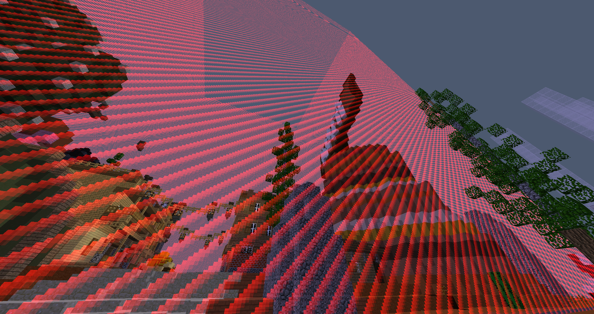
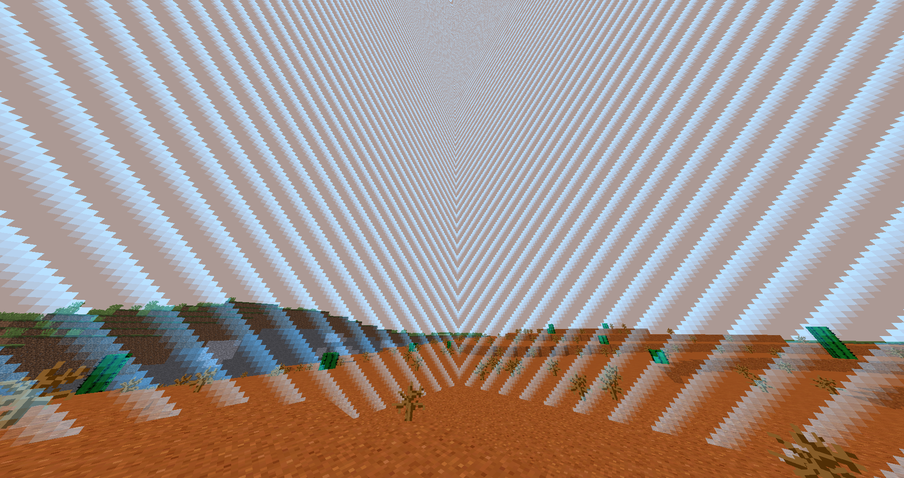

# Borders Module

## Overview
Using the border module will allow you to create and display custom borders to Lunar Client players.
Creating a border for Lunar Client players, won't only show a border around the world, but you'll be able to customize the border in multiple different ways.
For example, you can change the world the border is displayed in, the color of the border, if players can enter or exit the border, and if the border will expand or shrink in addition to a couple more features.
The truly neat part about this feature, is users on the 1.7 version of Lunar Client will be displayed the border, unlike in vanilla minecraft.

Red spawn border, to prevent combat tagged users from entering spawn.


Traditional world border, using the apollo borders module.


## Integration
Integrating the borders module into your plugins, is very simple, as displayed in the example code below.
We've also provided a step-by-step break down, for each part that is required in the packet to create and display a border for players.

<!-- include code snippet -->
```java
@Override
public void displayBorder(ApolloPlayer player, Border border) {
    requireNonNull(player, "player"); 
    requireNonNull(border, "border");

    ((AbstractApolloPlayer) player).sendPacket(DisplayBorderMessage.newBuilder()
    .setId(ByteString.copyFromUtf8(border.getId()))
    .setWorld(border.getWorld())
    .setCancelEntry(border.isCancelEntry())
    .setCancelExit(border.isCancelExit())
    .setCanShrinkOrExpand(border.isCanShrinkOrExpand())
    .setColor(NetworkTypes.toProtobuf(border.getColor()))
    .setBounds(NetworkTypes.toProtobuf(border.getBounds()))
    .setDurationTicks(border.getDuration())
    .build()
    );
}
```

<!-- example breakdown -->
## The Breakdown
**"setId()"** should include a unique identifier for the border.
```java
.setId(ByteString.copyFromUtf8(border.getId()))
```

**"setWorld()"** is the world, by name, that you wish to add the border to.
```java
.setWorld(border.getWorld())
```

**"setCancelEntry()"** is a boolean option to prevent players from entering the border, if they're outside the border bounds.
```java
.setCancelExit(false)
```

**"setCancelExit"** is a boolean option to prevent players from exiting the border, if they're currently inside the border bounds.
```java
.setCancelExit(false)
```

**"setCanShrinkOrExpand()"** is another boolean option to determine if the border can shrink or expand.
```java
.setCanShrinkOrExpand(true)
```

**"setColor()"** is how you dictate the color of the border, using hex colors.
```java
.setColor(#22000)
```

**"setBounds()"** is used to determine the bounds of the border.
```java
.setBounds(??)
```

**"setDurationTicks()"** is used to determine the speed of expansion or shrinkage.
```java
.setDurationTicks(10)
```

<!-- Show off some unique examples of the module being used, if there are any. (promo the people who use the Apollo) -->
## Public Use Cases
The borders module is currently being used on the following servers;
* play.vipermc.net (HCF & KitMap)
* play.minecadia.com (HCF, KitMap & Factions)
